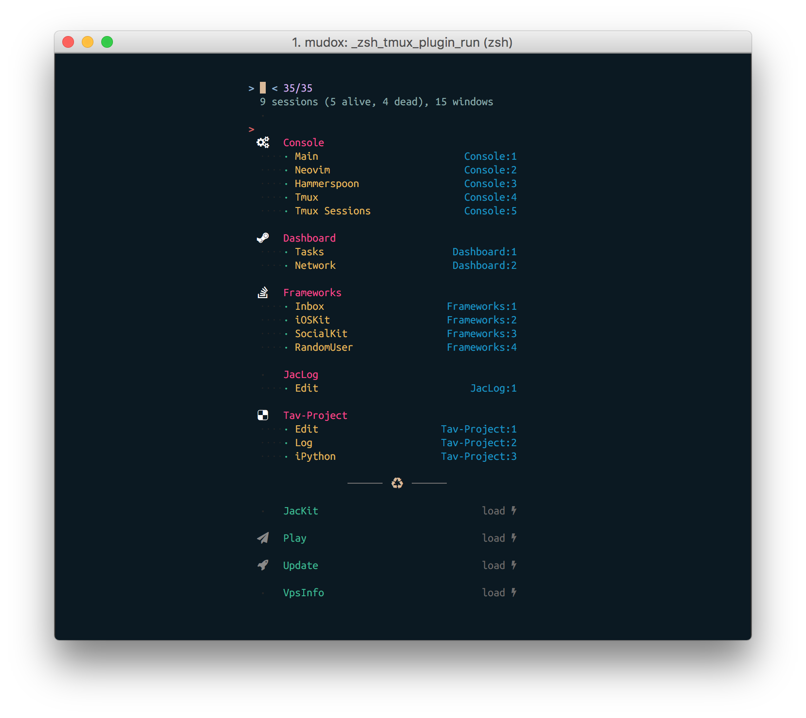

# Migration Note
This project is migrated to [tav](https://github.com/mudox/tav) from python to rust

# Tav (Tmux Navigator)

A tmux `choose-tree`replacement powered by fzf.

Symbol scheme: emoji. Color scheme: cool

Symbol scheme: nerd. Color scheme: hugo

## Getting Started

TBD

### Prerequisites

- [tmux](https://github.com/tmux/tmux)
- [fzf](https://github.com/junegunn/fzf)
-  Python 3.6+
